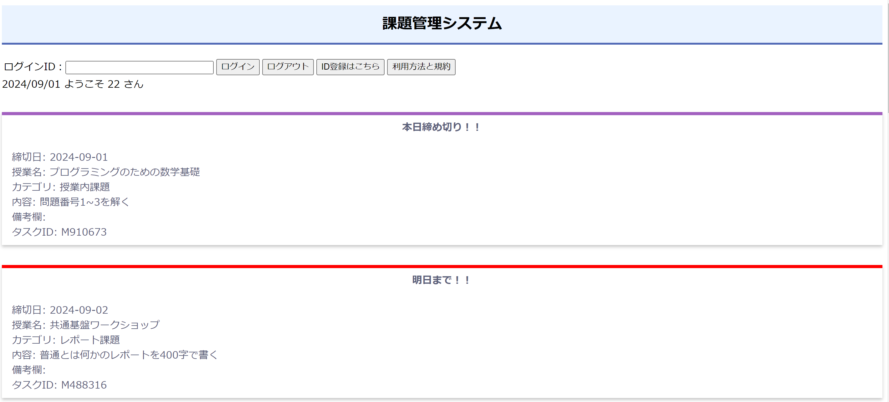
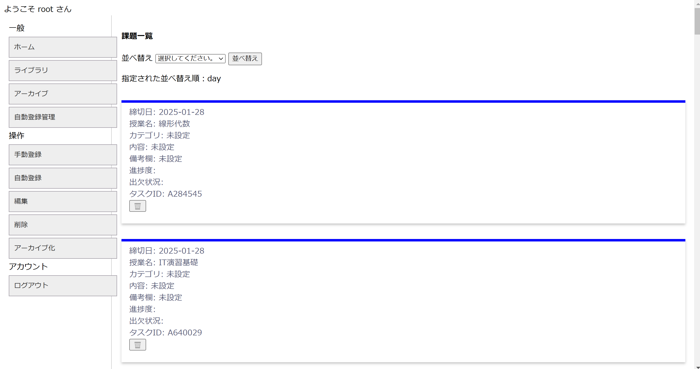
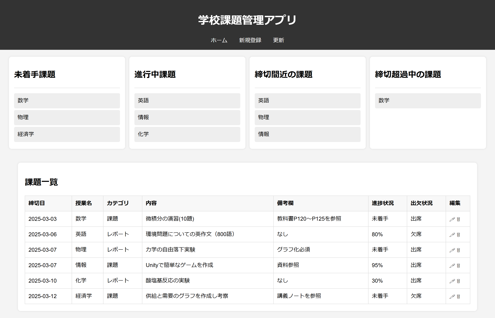

# TaskManagement Version3.0

学校課題管理Webアプリケーション

## 目次
- [概要](#概要)
- [Version1.0](#Version1.0)
- [Version2.0](#Version2.0)
- [Version3.0(本リポジトリ)](#Version3.0(本リポジトリ))
- [ディレクトリ構成](#ディレクトリ構成)
- [ライセンス](#ライセンス)

## 概要

大学や単位制の高校に通う学生・生徒（以下「ユーザー」とする）が、複数の授業で出題される宿題や課題を管理する従来の方法としては、課題が出題されるたびにタスク管理アプリを開き、タイトルや内容を入力し、期限を設定する必要がありました。

しかし、これらのユーザーは単位制であるがゆえに固定された時間割を持っており、毎週決まった曜日・授業で必ず課題が出題されるケースも少なくありません。そのため、同様のタスクを定期的に手動で追加する必要が生じます。

このように、課題を毎回登録する作業が習慣化されることはユーザーにとって負担となり、結果としてタスク管理アプリの利用継続が難しくなり、ユーザーが離れる原因となる場合があると考えました。

そこで本アプリでは、ユーザーがあらかじめ時間割を登録するだけで、曜日ごとに自動的にタスクを追加できる仕組みを導入しました。これにより、課題管理にかかる手間を削減し、前述した問題の解決、解消、または軽減を目指しました。

また本プロジェクトは、2024年9月頃に PHP を用いた Version 1.0 を開発し、2024年12月頃には機能を拡張した Version 2.0 を開発しました。

さらに、2025年9月にはバックエンド言語を Java に変更し、UI/UX の改善を行った Version 3.0（本リポジトリ） を開発するなど、段階的に改良を重ねてきた長期的なプロジェクトです。

今後も利便性のさらなる向上を目指し、継続的に開発・改善を行っていく予定です。

### Version1.0

使用技術：HTML / CSS / PHP / MySQL

#### 実装機能 ####
<ul>
    <li>タスクの通常登録（従来型の手動登録）</li>
    <li>タスクの自動登録</li>
    <li>タスクの編集</li>
    <li>タスクの削除</li>
    <li>タスクのアーカイブ機能</li>
    <li>期限が近づいているタスクの視覚的強調表示</li>
</ul>

#### 開発と課題 ####

本アプリは、大学1年生の夏休み期間中に必要な技術を独学し、初めてWebアプリケーションとして開発・運用を行いました。

開発において特に重要であったのが、「曜日ごとに自動的にタスクを追加する仕組み」の実装です。この機能では、毎日その日の曜日情報を取得し、時間割を管理するテーブルと照合した上で、該当するデータのみをタスク管理テーブルへ登録する必要がありました。

この処理をどのタイミングで実行するかが課題となりました。例えば、ユーザーのアクセス時に1日1回のみ処理を実行する方式では、ユーザーがその日に一度もアクセスしなかった場合、自動登録が行われません。また、PHP単体では定期的に自動実行することができないという制約もありました。

そこで、サーバー側の cron 設定を利用することにしました。曜日判定およびデータ登録処理を1つのPHPファイルにまとめ、cronにより毎日指定時刻に実行することで、ユーザーのアクセス有無に依存しないタスクの自動登録機能を実現しました。

### Version2.0

使用技術：HTML / CSS / JavaScript / PHP / MySQL

#### 追加機能 ####
<ul>
    <li>タスクの検索機能</li>
    <li>メール通知機能</li>
    <li>UI / UX の改善</li>
</ul>
#### 運用課題と解決 ####

    Version 1.0 のリリース後、数か月間にわたり実際に運用し、私自身が継続的に利用しました。その結果、以下のような運用上の課題が明らかになりました。

<ul>
    <li>タスク数の増加に伴い、一覧画面でのスクロール量が多くなり、目的のタスクを見つけづらくなった</li>
    <li>期限が近づいている課題に気づきにくいケースが発生した</li>
</ul>

これらの課題に対し、締切日・授業名・カテゴリを条件としてタスクを絞り込める検索機能を実装しました。これにより、不要なスクロール操作を削減し、目的のタスクへ素早くアクセスできるようにしました。

さらに、期限が近づいたタスクに対してユーザーへ自動で通知を行うメール通知機能を導入しました。これにより、アプリを開かなくても課題の存在を認識できるようになり、提出漏れの防止につなげています。

UI面では、タスクの登録・アーカイブ化・削除といった操作を行う際に画面遷移を発生させず、JavaScriptによるポップアップ（モーダル）を用いる設計に変更しました。これにより、操作回数を減らし、ユーザー体験の向上を図りました。

### Version3.0(本リポジトリ)

使用技術：HTML / CSS / JavaScript / Java / MySQL

#### 技術的課題と再開発 ####

Version 2.0 までは共用サーバー上で運用していましたが、Version 3.0 からは VPS サーバーへ移行する方針としたため、アプリケーション構成およびデータベース設計を含めた修正が必要となりました。

また、Version 2.0 を継続的に利用する中で、以下のような機能拡張が必要であると考えました。

<ul>
    <li>オンデマンド型授業を含む出欠状況の管理</li>
    <li>タスクの進捗状況の可視化および管理</li>
</ul>

これらの機能追加および環境変更に対応しようとした際、既存コードの保守性・拡張性に課題があることに気づきました。

Version 2.0 までの実装では、当時オブジェクト指向設計やクラス・メソッドの概念を十分に理解できていなかったこともあり、処理が一部に集中した構造となっていました。その結果、修正や新機能の追加に時間を要するようになっていました。

これらの課題を根本的に解決するため、Version 3.0 ではアプリケーションの全面的な再開発を行う判断をしました。

再開発にあたっては、使用言語を PHP から Java に変更し、MVC モデルを採用しました。オブジェクト指向の設計思想に基づいて機能ごとに分離することで、VPS 環境への対応とともに、新機能の追加や今後の拡張を見据えた構成へと改善することができました。

#### 今後の展望 ####

サーバー環境の変更に伴い、Version 3.0 では従来のメール通知機能を一時的に停止しています。今後は、VPS サーバー上にメールサーバーを構築した上で、メール通知機能の再実装を行う予定です。

## ディレクトリ構成
<pre>
.
│  .classpath
│  .gitignore
│  .project
│
├─.settings
│      .jsdtscope
│      org.eclipse.core.resources.prefs
│      org.eclipse.jdt.core.prefs
│      org.eclipse.wst.common.component
│      org.eclipse.wst.common.project.facet.core.xml
│      org.eclipse.wst.jsdt.ui.superType.container
│      org.eclipse.wst.jsdt.ui.superType.name
│
├─build
│  └─classes
│      ├─Beans
│      │      accountBeans.class
│      │      editBeans.class
│      │      indexBeans.class
│      │      insertAuto.class
│      │      insertBeans.class
│      │      loginBeans.class
│      │
│      ├─Dao
│      │      accountDao.class
│      │      editDao.class
│      │      indexDao.class
│      │      insertDao.class
│      │      loginDao.class
│      │
│      ├─Logic
│      │      loginLogic.class
│      │
│      └─Servlet
│              accountServlet.class
│              deleteServlet.class
│              editServlet.class
│              indexServlet.class
│              insertServlet.class
│              loginServlet.class
│              logoutServlet.class
│
└─src
    └─main
        ├─java
        │  ├─Beans
        │  │      accountBeans.java
        │  │      editBeans.java
        │  │      indexBeans.java
        │  │      insertAuto.java
        │  │      insertBeans.java
        │  │      loginBeans.java
        │  │
        │  ├─Dao
        │  │      accountDao.java
        │  │      editDao.java
        │  │      indexDao.java
        │  │      insertDao.java
        │  │      loginDao.java
        │  │
        │  ├─Logic
        │  │      loginLogic.java
        │  │
        │  └─Servlet
        │          accountServlet.java
        │          deleteServlet.java
        │          editServlet.java
        │          indexServlet.java
        │          insertServlet.java
        │          loginServlet.java
        │          logoutServlet.java
        │
        └─webapp
            │  account.css
            │  account.jsp
            │  edit.css
            │  edit.jsp
            │  edit.png
            │  error.jsp
            │  icon.ico
            │  index.jsp
            │  insert.css
            │  insert.jsp
            │  login.css
            │  login.jsp
            │  policy.jsp
            │  style.css
            │  trush.png
            │
            ├─META-INF
            │      MANIFEST.MF
            │
            └─WEB-INF
                └─lib
                        mysql-connector-j-8.4.0.jar
</pre>

## ライセンス
MIT License
このプロジェクトは個人開発プロジェクトです。

©2024-2026 EBATA TAKUMI
